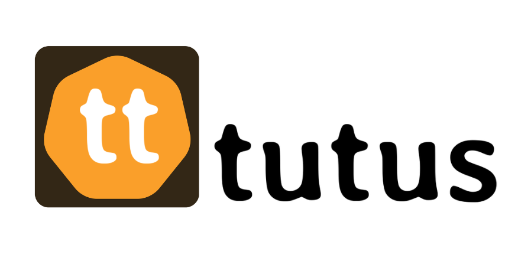

    

# Tutus 🐾

O **Tutus** é um aplicativo móvel desenvolvido para tutores de animais de estimação, reunindo em um único ambiente ferramentas para organização dos cuidados dos pets e interação entre tutores.

## Objetivo

O aplicativo tem como objetivo facilitar o acompanhamento da rotina e dos cuidados dos animais de estimação, permitindo o registro de informações importantes em um ambiente privado.

Além disso, o Tutus oferece um espaço de interação onde os tutores podem compartilhar momentos e conteúdos relacionados aos seus pets.

## Problemas que o aplicativo busca solucionar

- Desorganização das informações relacionadas aos cuidados dos pets;
- Dificuldade para acompanhar informações como peso, alimentação, vacinas, consultas e medicamentos;
- Excesso de conteúdos variados nas redes sociais tradicionais;
- Falta de um espaço de interação dedicado exclusivamente ao universo pet.

## Público-alvo

Tutores de animais de estimação em geral, independentemente da espécie.

## Diferencial

O diferencial do Tutus é reunir **organização e interação social em um único aplicativo**, permitindo que o tutor acompanhe os cuidados do pet e, ao mesmo tempo, compartilhe conteúdos e interaja com outros tutores.

## Funcionalidades

- Cadastro e login de usuários;
- Cadastro de um ou mais pets;
- Perfil privado do pet;
- Acompanhamento de peso e alimentação;
- Registro, notificações e lembretes de vacinas, consultas e medicamentos;
- Gráficos para acompanhamento de informações do pet;
- Perfil público do pet;
- Publicações de fotos e vídeos;
- Feed com publicações de outros tutores (comunidade!);
- Interação entre tutores;
- Personalização do tema do aplicativo;
- Perfil e configurações do tutor.

## Tecnologias utilizadas (até o momento)

- React Native.
- Expo.
- JavaScript.
- Git & Github.

## Status do projeto

**Em desenvolvimento.**

## Equipe 👩‍💻

- Éveny Oliveira.
- Isabele Moura.

---

  Projeto acadêmico desenvolvido para a disciplina de Programação para
  Dispositivos Móveis em Android.

