<p align="center">
    
</p>

# Tutus 🐾

O **Tutus** é o aplicativo móvel idealizado para este projeto acadêmico, voltado para tutores de animais de estimação e visando reunir, em um único ambiente, recursos para a organização dos cuidados dos pets e a interação entre tutores.

## Sobre o projeto

O **Tutus** está sendo desenvolvido como parte de um projeto acadêmico voltado para o desenvolvimento de aplicações móveis, tendo como principal ferramenta a ser o usada o *React Native*. A proposta é criar um ambiente que auxilie na organização da rotina e no acompanhamento dos principais cuidados relacionados aos animais de estimação.

O aplicativo está sendo planejado para permitir o registro e acompanhamento de informações como peso, alimentação, vacinas, consultas e medicamentos, mantendo esses dados em uma área privada destinada ao gerenciamento de cada animal. Com isso, busca-se facilitar a organização dessas informações e torná-las mais acessíveis no dia a dia do tutor.

Além da área de gerenciamento, o projeto prevê uma comunidade dedicada ao universo pet, na qual os tutores poderão compartilhar momentos e conteúdos relacionados aos seus animais e interagir com outros usuários. Dessa forma, o **Tutus** busca unir organização dos cuidados e interação social em uma mesma aplicação.

A proposta também busca minimizar problemas como a desorganização das informações relacionadas aos cuidados dos pets, dificuldade para acompanhar e registrar dados importantes, o excesso de conteúdos variados presentes nas redes sociais tradicionais e a falta de um espaço de interação dedicado exclusivamente ao universo pet.

## Funcionalidades Implementadas

- Telas de Splash, Boas-vindas, Login, Criar Conta e Recuperação de Senha, com validações;
- Navegação com React Navigation e barra inferior (Início, Comunidade, Meu Pet e Tutor);
- Cadastro, edição, seleção e exclusão de pets, com dados salvos em SQLite;
- Início com resumo do dia, previsão da próxima refeição, gráficos de alimentação e peso e agenda de cuidados;
- Meu Pet com registro de alimentação, peso, vacinas, consultas e medicamentos;
- Perfil do Tutor com dados da conta, lista de pets e preferências;
- Comunidade com feed, publicações com foto e legenda, curtidas e perfil público do pet;
- Pop-ups de alerta e componentes visuais padronizados no estilo do app.
- Central de notificações com lembretes de cuidados dos pets;
- Personalização das cores e do tema do aplicativo;
- Recuperação de senha por código de verificação enviado por e-mail;
- Compartilhamento remoto de publicações entre diferentes dispositivos;
- Armazenamento de publicações, curtidas e comentários em PostgreSQL;
- Adição, alteração e exclusão da foto de perfil do tutor;
- Exclusão de publicações na Comunidade.

## Interface do aplicativo

O Tutus possui o laranja como cor padrão de sua identidade visual, permitindo também a personalização do tema conforme a preferência do tutor.

### Telas de acesso

<p align="center"><em>Boas-vindas • Login • Criar conta • Recuperação de senha</em></p>

<p align="center">
  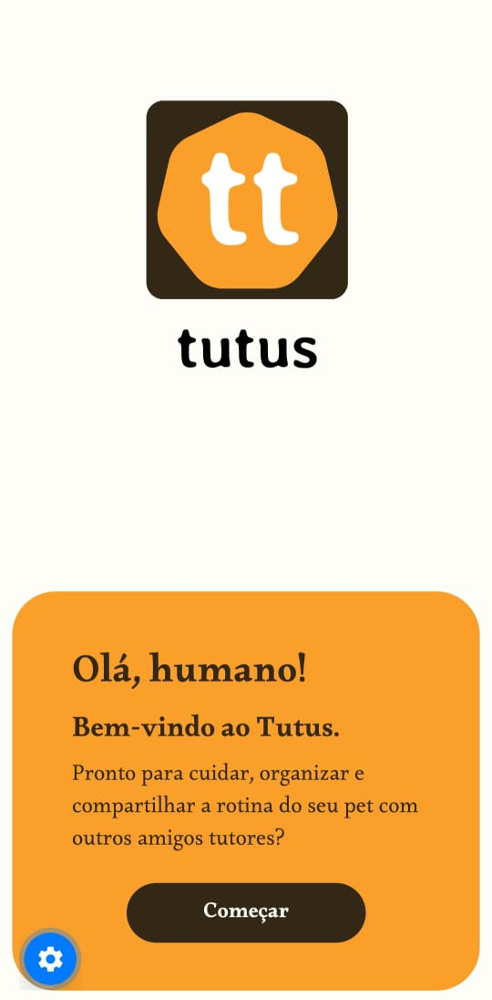
  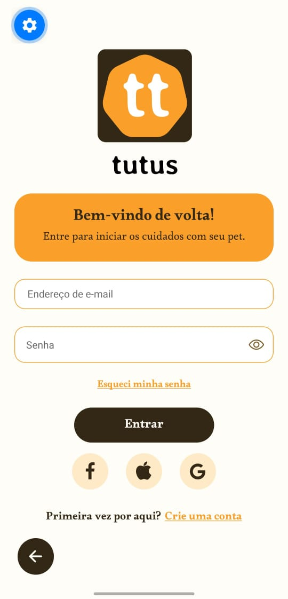
  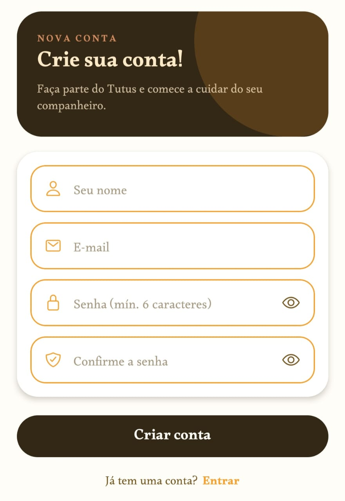
  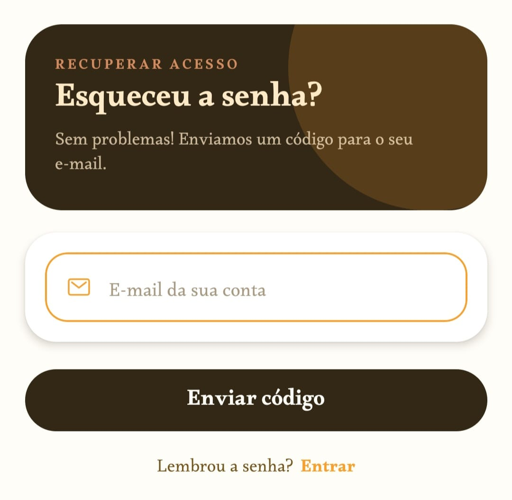
</p>

### Tema padrão — Laranja

<p align="center"><em>Início • Meu Pet • Comunidade • Perfil público</em></p>

<p align="center">
  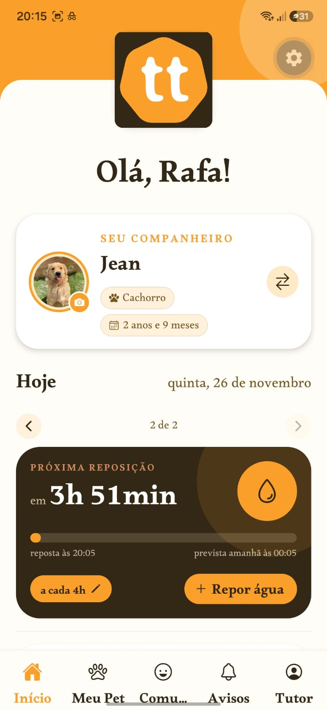
  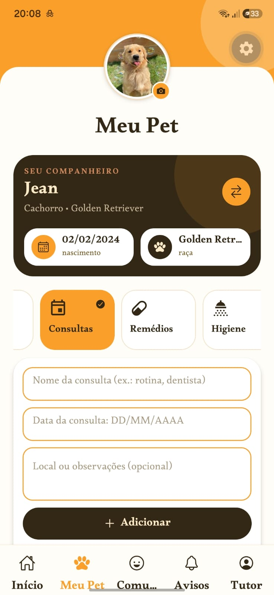
  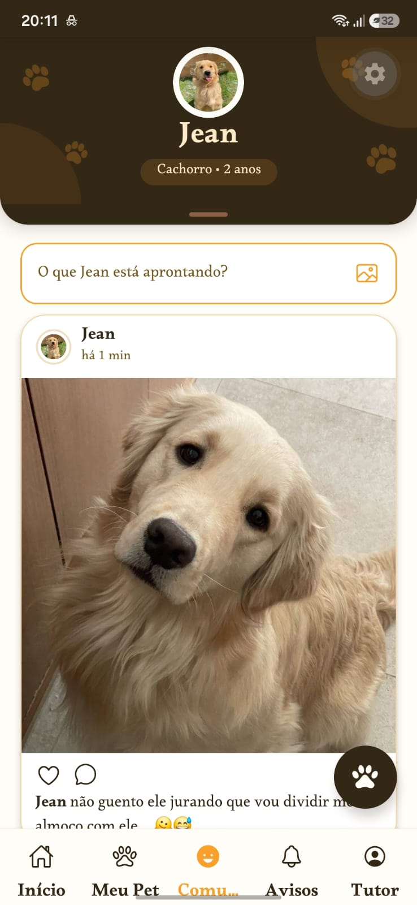
  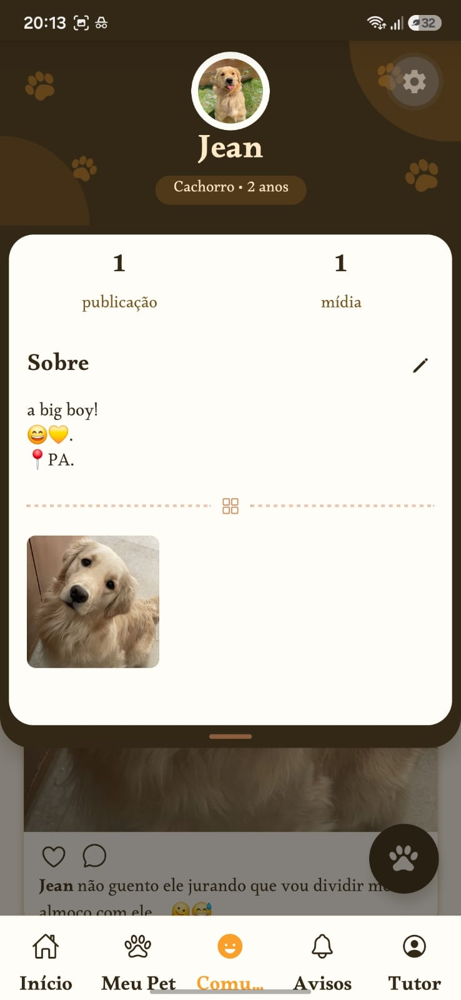
</p>

### Personalização — Tema azul

<p align="center"><em>Início • Meu Pet • Tutor</em></p>

<p align="center">
  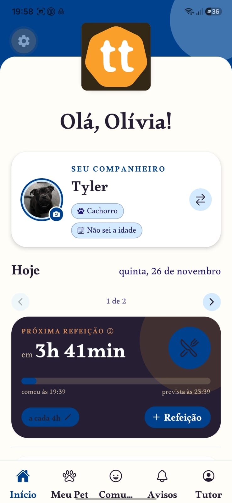
  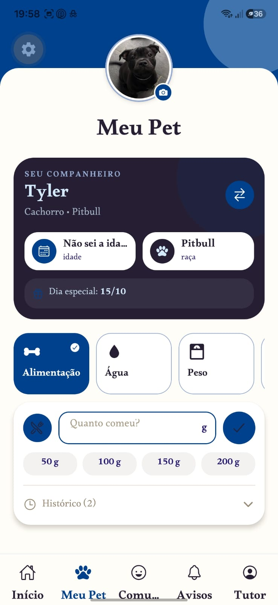
  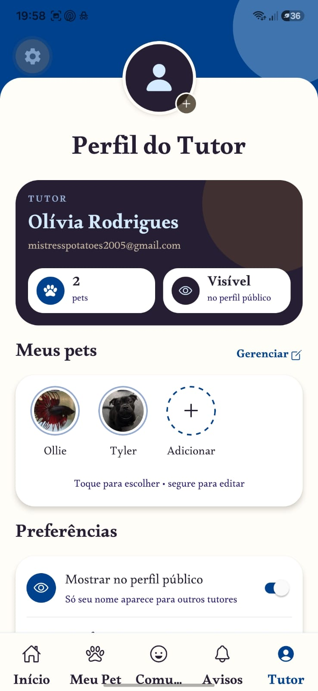
</p>

<p align="center"><em>Gráficos e agenda • Calendário de higiene</em></p>

<p align="center">
  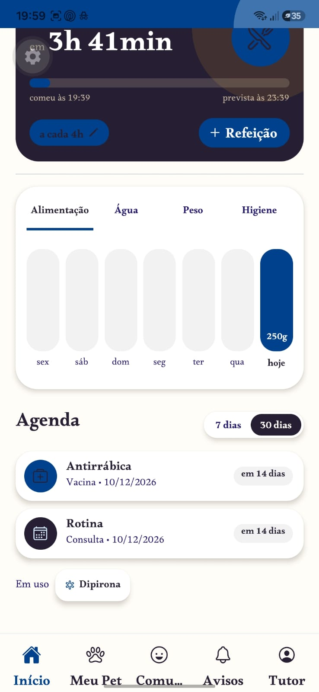
  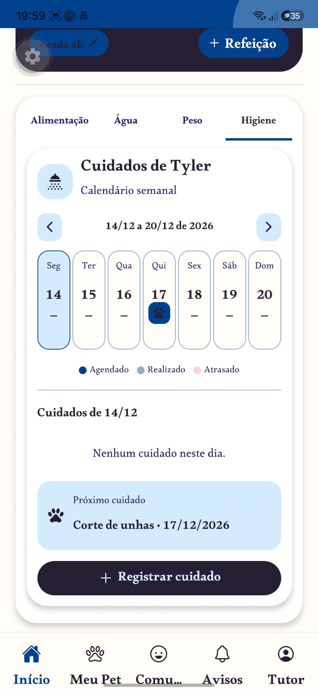
</p>

<p align="center"><em>Comunidade • Publicações • Perfil público</em></p>

<p align="center">
  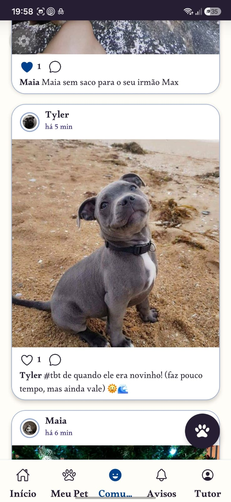
  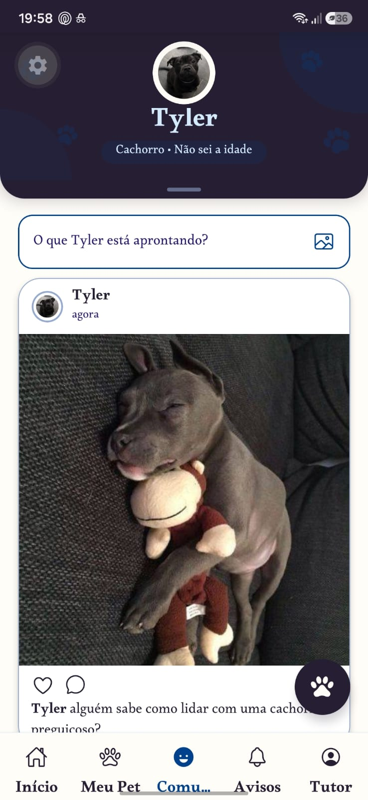
  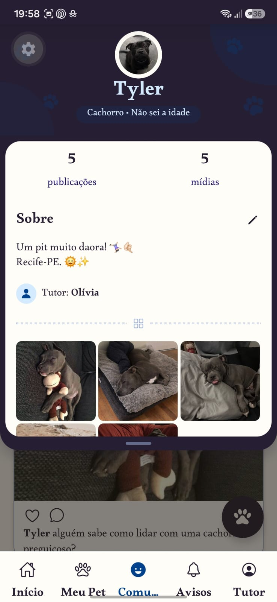
</p>

### Personalização — Tema verde

<p align="center"><em>Início • Meu Pet • Comunidade</em></p>

<p align="center">
  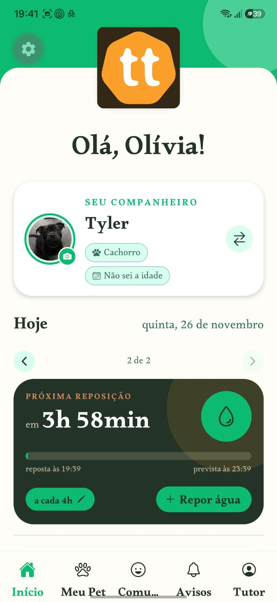
  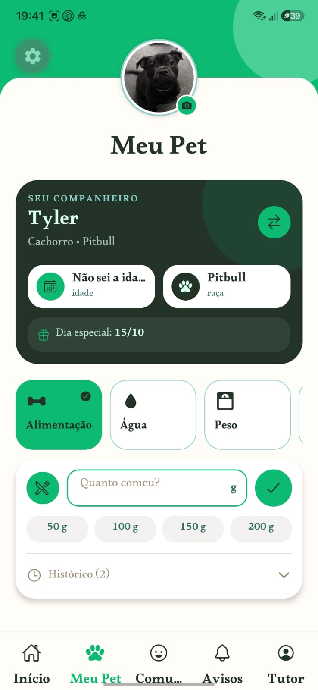
  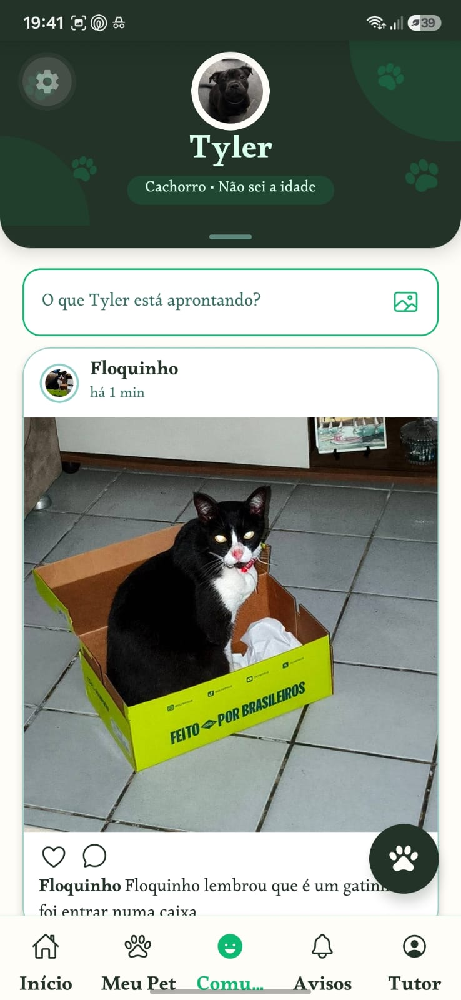
</p>

## Funcionalidades planejadas

- Aprimoramento do perfil público do pet e da experiência na Comunidade;
- Publicações de vídeos na Comunidade;
- Integração completa com serviços remotos para armazenamento e compartilhamento de dados;
- Aprimoramento da segurança e da autenticação dos usuários;
- Aprimoramento das interfaces, design e experiência de navegação.

## Tecnologias utilizadas

- React Native e Expo;
- React Navigation;
- JavaScript;
- SQLite (expo-sqlite);
- Git & Github.
- Node.js;
- Express;
- PostgreSQL;
- Render (hospedagem do backend e banco de dados);
- Brevo (envio de e-mails);
- Expo Notifications (notificações e lembretes).

## Como executar

1. Instale o [Node.js](https://nodejs.org) e o app **Expo Go** no celular.
2. Clone o repositório e instale as dependências:
   ```bash
   git clone https://github.com/ejoliveira-dev/app-pai-de-pet.git
   cd app-pai-de-pet
   npm install
   ```
3. Inicie o projeto:
   ```bash
   npx expo start
   ```
4. Leia o QR Code com o Expo Go (o celular e o computador precisam estar na mesma rede).

> **Requisito:** Expo SDK 57. No celular, use o **Expo Go** compatível com o SDK 57.

## Status do projeto

**Versão funcional concluída, com melhorias futuras planejadas.**

## Equipe 👩‍💻

- Éveny Oliveira.
- Isabele Moura.

---

<p align="center">
  Projeto acadêmico desenvolvido para a disciplina de Programação para
  Dispositivos Móveis em Android.
</p>
